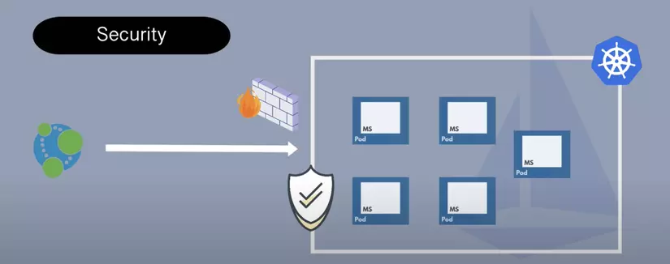
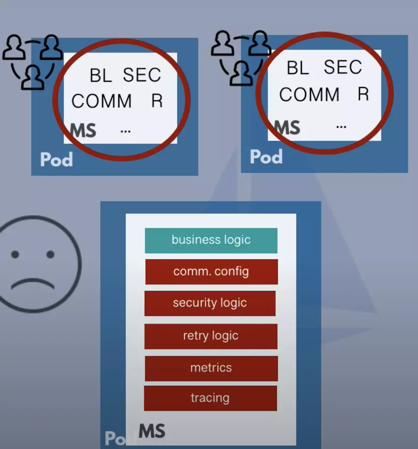
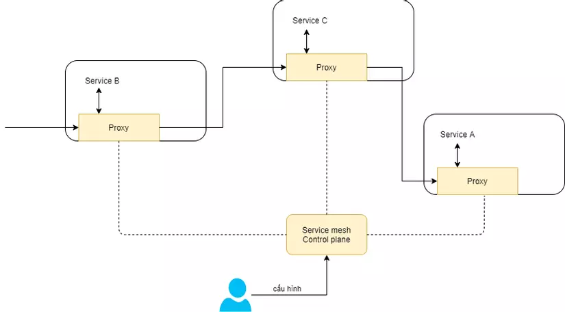
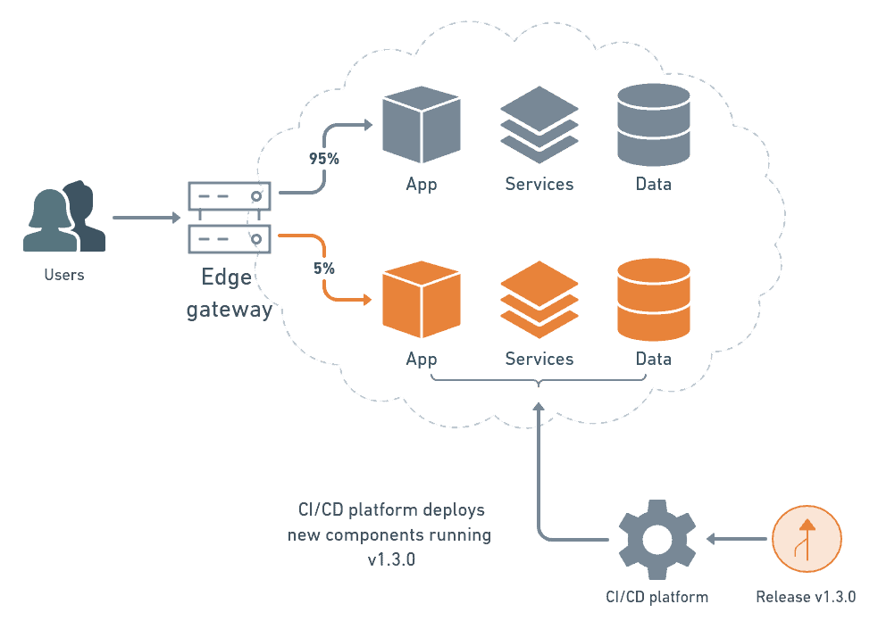

# SERVICE MESH TRONG KUBERNETESS

## 1. ĐỊNH NGHĨA
### **1.1. Tại sao cần service mesh**

Trong kiến trúc Microservice, một service cần phải giao tiếp với các service khác qua endpoint. Do đó cần cấu hình endpoint của từng service, để web server có thể hoạt động. Khi scale ứng dụng lên và có nhiều thêm các microservice, ta sẽ phải config endpoint lại cho tất cả các service đã hoạt động trước đó.

Về vấn đề security, Kubernetes cluster sẽ có kiến trúc như sau:
 

Chúng ta có firewall hoặc proxy để tránh Kubernetes cluster được truy cập trực tiếp, bảo vệ cho các service bên trong cluster. Tuy nhiên, khi request đi vào bên trong cluster, các service giao tiếp tự do với nhau bên trong cluster - và không được bảo mật. Khi kẻ tấn công vượt qua firewall / proxy để vào bên trong cluster, hắn có thể lấy các thông tin nhạy cảm của user. Vì vậy chúng ta cần bổ sung các security logic cho service để đảm bảo an toàn cho việc giao tiếp giữa các service bên trong cluster.

Mỗi service cũng cần được implement retry logic để khi service không thể truy cập, hoặc các service khác mất kết nối, tự nó có thể khởi động lại, để đảm bảo giao tiếp thông suốt.

Ngoài ra, ta cũng cần monitor cách hoạt động của service, cần nắm được các thông số về thời gian service xử lý 1 request, số lượng request/response của service. 

Cuối cùng mỗi service sẽ được implement thêm rất nhiều các logic bên cạnh business logic của service
 

**Kết quả là developer sẽ không còn tập trung vào phát triển logic cho service mà còn phải xử lý cả các logic về network cho metrics, security, communication,... Điều này khiến các service trở nên phức tạp và không còn đơn giản, gọn nhẹ như mục tiêu của microservice nữa.**

### **1.2. Service Mesh là gì?**

Để giải quyết vấn đề trên, chúng ta cần tách biệt các non-business logic với business logic khỏi service bằng solution được gọi là Service Mesh.

*Service mesh là một giải pháp tăng cường khả năng giao tiếp giữa các thành phần trong hệ thống, cụ thể ở đây là các service trong cụm kubernetes.*

Kubernetes service mesh cung cấp các chức năng chính:
- Kết nối các service trong cụm kubernetes
- Mã hóa gói tin liên lạc
- Theo dõi, quan sát việc giao tiếp giữa các service, từ đó người dùng có thể troubleshoot, maintain hoặc đưa ra quyết định tối ưu hệ thống.

Để làm được đều này thì service mesh cần có cấu trúc khá đặc biệt:

 

Nó gồm hai thành phần chính:

- Sidecar proxy: với mỗi service của Kubernetes, một proxy tương ứng sẽ được tạo ra, proxy này có thể can thiệp tất cả các request vào/ra service (encrypt, decrypt message, thêm request header, forward request, drop request, …). Đây chính là cách thức để Service mesh thiết lập kết nối bảo mật và mã hóa gói tin truyền đạt giữa các service trong cụm kubernetes – thông qua proxy.

- Control plane: thành phần cốt lõi của service mesh, tạo ra các proxy tự động dựa trên cấu hình của người quản trị.

## 2. Ưu, nhược điểm
### **2.1. Ưu điểm:**
- Đơn giản hóa việc giao tiếp giữa các services trong mô hình microservices. Sidecar proxy được đặt cạnh container services, kiểm soát toàn bộ các giao tiếp mạng, sẽ rất tiện ích cho việc quản lý network.
- Dễ dàng cho việc điều tra, phân tích những lỗi liên quan đến network khi xảy ra ở tầng infrastructure.
- Mã hoá, bảo mật, xác thực các kết nối, giao tiếp giữa các service.
- Giúp developer tập trung vào business logic, không cần quan tâm tới các network logic

### **2.2. Nhược điểm:**

- Service Mesh mang lại những tiện ích về mặt Network, nhưng lại tăng độ trễ cho thời gian thực thi và giao tiếp, do request phải đi qua những Sidecar Proxy.

## 3. Use case của Service mesh

**1. Traffic Management.**
 
*Ví dụ: Hỗ trợ Canary Deployment*

- Trong các chiến lược deploy zero downtime, thì canary deployment là một chiên lược ít tốn kém nhất khi cho phép triển khai phiên bản mới của ứng dụng với một phần nhỏ trong hệ thống và nhận feedback để cải thiện. Tuy nhiên chúng ta cần chia lưu lượng để đám bảo cân bằng tải.  

 

- Với service mesh chúng ta có thể dễ dàng tách lưu lượng sang phiên bản mới 5% và 95% về phiên bản cũ.
  
**2. Cân bằng tải.**

**3. Service Discovery**: 

**4. Security:** 

**5. Observability:** 
Sử dụng trong các tool về tracing, logging, and monitoring 

## 4. Vấn đề với sidecar và cải tiến với eBPF
https://thenewstack.io/how-ebpf-streamlines-the-service-mesh/

